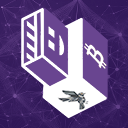

<p align="center">
  
</p>

<h1 align="center">Bitcoin on Tails</h1>

<p align="center"><i>A Bitcoin full-node installer for <a href="https://tails.net/">Tails OS</a>.</i></p>

Bitcoin on Tails (BoT) is a small set of bash scripts that install and update a Bitcoin full node — Bitcoin Core or Bitcoin Knots — on Tails, with Sparrow Wallet as an optional add-on. Releases are downloaded over Tor, verified against pinned signing keys, and installed into Tails Persistent Storage so your node and wallets survive reboot.

BoT does not generate seeds, design backup schemes, or pick wallet policies for you. It installs the upstream software, gets it talking to your local node over `localhost`, and otherwise stays out of the way.

## What it installs

- **Bitcoin Core** or **Bitcoin Knots** — pick one at install time. Both are full-node implementations; Knots is Luke Dashjr's fork with extra relay policy options.
- **Sparrow Wallet** (optional) — desktop Bitcoin wallet that talks to your local Core/Knots node over RPC, so wallet queries never leak to a third-party Electrum server.

Everything runs inside Tails, so all network traffic goes through Tor by default.

## How verification works

Every release is verified before it's installed. There is no curl-pipe-bash, no anonymous mirror.

- **Bitcoin Core** — multi-signer verification against [bitcoin-core/guix.sigs](https://github.com/bitcoin-core/guix.sigs). The installer requires at least 3 valid signatures from the published builders for the exact release file before unpacking it.
- **Bitcoin Knots** — single-signer verification against Luke Dashjr's PGP key, matching the publication model upstream uses.
- **Sparrow Wallet** — single-signer verification against Craig Raw's pinned PGP fingerprint, fetched from cache, Keybase, GitHub, or a keyserver and double-checked against the value baked into the script.

If signature verification fails, the install stops and tells you why.

## What lives where

Tails wipes everything on shutdown except what's inside Persistent Storage. BoT puts the stuff that needs to persist there:

- `~/Persistent/.bitcoin/` — chain data, wallets, `bitcoin.conf`
- `~/.local/share/bot/` — installer source, used for in-place `git pull` updates
- `dotfiles/` — autostart entries, desktop icons, and the wrappers BoT drops into `PATH`

The first run helps you turn on Persistent Storage and the right TPS features (Dotfiles, Persistent Folder) if they aren't already on.

## Tools shipped in `PATH`

- `b` — top-level installer / updater. Run with no arguments to install or update; pass `--version` to print the BoT version.
- `bot-menu` — yad-based control panel. Status, About, and (in progress) Update / Uninstall tabs.
- `install-core`, `install-knots`, `install-sparrow` — standalone installers for each component.
- `bot-backup` — wraps `tails-installer --backup` to clone your stick to a second USB.
- `ibd-progress` — tiny progress reporter for initial block download.
- `stop-btc` — graceful `bitcoind` shutdown.

## Install

### You need

- A USB stick of at least 32 GB
- A computer with at least 2 GB of RAM that can boot from USB
- About an hour: ~30 min to install Tails, ~15 min for BoT, the rest is download
- Enough free space for the Bitcoin blockchain (currently several hundred GB)

### Steps

1. **[Install Tails](https://tails.net/install/index.en.html)** to your USB stick.
2. **[Boot Tails](https://tails.net/doc/first_steps/start/index.en.html).** At the Welcome Screen, skip Persistent Storage for now — BoT will help you set it up.
3. **Connect to a network** and **[connect to Tor](https://tails.net/doc/anonymous_internet/tor/index.en.html)**.
4. Open **Applications → Utilities → Terminal** and run:

   ```bash
   git clone https://github.com/satscoffee/bitcoin-on-tails ~/bot && ~/bot/b
   ```

5. When prompted, pick **Bitcoin Core** or **Bitcoin Knots**, then optionally install Sparrow Wallet.
6. Let initial block download finish. Lock the screen with `❖+L` if you step away.

### Updating

Run `b` again. It detects an existing install and updates in place.

## Status

BoT is currently **alpha**. The installer flow, release verification, and Persistent Storage integration are working. The control panel (`bot-menu`) ships a Status tab and About tab; Update / Uninstall actions are being wired up next. Expect rough edges, and please file issues.

See [`docs/FAQ.md`](docs/FAQ.md) and [`docs/Advantages_and_Disadvantages.md`](docs/Advantages_and_Disadvantages.md) for more.

## Verifying releases

Release tags and commits are signed by the BoT signing key:

```
2EE3 5C29 41D5 4C9E 9E2D  C908 33A3 9346 82DD 9E18
```

UID: `Satoshi Coffee Co. <hey@sats.coffee>`. You can fetch it from a keyserver or from `https://sats.coffee/2EE35C2941D54C9E9E2DC90833A3934682DD9E18.asc` and verify a tag with:

```bash
git tag -v v0.7.3-alpha
```

## Issues and feedback

File issues at <https://github.com/satscoffee/bitcoin-on-tails/issues>.

## License

MIT — see [`LICENSE`](LICENSE).

```
Copyright (c) 2026 Satoshi Coffee Co.

Permission is hereby granted, free of charge, to any person obtaining a copy
of this software and associated documentation files (the "Software"), to deal
in the Software without restriction, including without limitation the rights
to use, copy, modify, merge, publish, distribute, sublicense, and/or sell
copies of the Software, and to permit persons to whom the Software is
furnished to do so, subject to the following conditions:

The above copyright notice and this permission notice shall be included in
all copies or substantial portions of the Software.

THE SOFTWARE IS PROVIDED "AS IS", WITHOUT WARRANTY OF ANY KIND, EXPRESS OR
IMPLIED, INCLUDING BUT NOT LIMITED TO THE WARRANTIES OF MERCHANTABILITY,
FITNESS FOR A PARTICULAR PURPOSE AND NONINFRINGEMENT. IN NO EVENT SHALL THE
AUTHORS OR COPYRIGHT HOLDERS BE LIABLE FOR ANY CLAIM, DAMAGES OR OTHER
LIABILITY, WHETHER IN AN ACTION OF CONTRACT, TORT OR OTHERWISE, ARISING FROM,
OUT OF OR IN CONNECTION WITH THE SOFTWARE OR THE USE OR OTHER DEALINGS IN
THE SOFTWARE.
```
